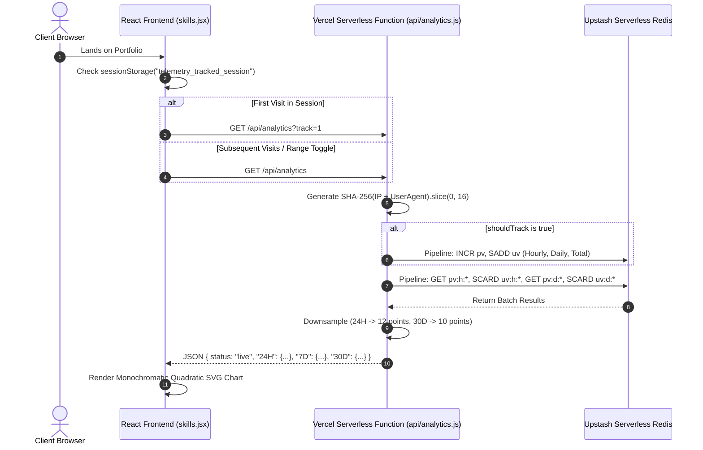

# 📖 THE PORTFOLIO SYSTEM BIBLE: ARCHITECTURE, ENGINE & CODEBASE SPECIFICATION
**Author:** Yaswanth Babu Patnam  
**System:** High-Performance Monochromatic Engineering Portfolio  
**Target Platform:** React 18, Vite 4, Tailwind CSS 3, Vercel Serverless, Upstash Redis  
**Repository:** `https://github.com/Yaswanthpatnam/Portfolio.git`  
**Live Production URL:** `https://yaswanth-babu.vercel.app/`

---

## TABLE OF CONTENTS
1. [Executive Summary & Core Philosophy](#1-executive-summary--core-philosophy)
2. [End-to-End Technology Stack](#2-end-to-end-technology-stack)
3. [Repository Topology & File Taxonomy](#3-repository-topology--file-taxonomy)
4. [The Railway Engine & Spline Mathematics](#4-the-railway-engine--spline-mathematics)
5. [The Headlight Volumetric Ray-Marching System](#5-the-headlight-volumetric-ray-marching-system)
6. [Desktop Companion Pixel Dog Engine](#6-desktop-companion-pixel-dog-engine)
7. [Full-Stack Telemetry: Serverless & Upstash Redis](#7-full-stack-telemetry-serverless--upstash-redis)
8. [GitHub Dynamic Ingestion Pipeline](#8-github-dynamic-ingestion-pipeline)
9. [The 53-Week Rolling Activity Matrix Engine](#9-the-53-week-rolling-activity-matrix-engine)
10. [Quadratic SVG Telemetry Chart Generator](#10-quadratic-svg-telemetry-chart-generator)
11. [Component Architecture Deep-Dive](#11-component-architecture-deep-dive)
12. [Bottlenecks, Failure Modes & Engineering Solutions](#12-bottlenecks-failure-modes--engineering-solutions)
13. [DevOps, Build Optimization & Maintenance Runbook](#13-devops-build-optimization--maintenance-runbook)

---

## 1. EXECUTIVE SUMMARY & CORE PHILOSOPHY

This portfolio is not a standard static resume template. It is engineered as an **interactive, high-precision distributed systems showcase** built with extreme craftsmanship. 

### Core Tenets:
1. **Monochromatic Brutalism Meets Swiss Elegance**: Zero garish rainbow gradients. Deep obsidian black (`#000000`), subtle dark zinc borders (`rgba(255,255,255,0.08)`), pure white accents (`#ffffff`), and calibrated typography scales.
2. **Mathematical Precision Over CSS Gimmicks**:
   - Continuous Catmull-Rom splines converted to cubic Beziers with guaranteed monotonic $Y$-trajectories.
   - Binary search algorithms along SVG paths for sub-pixel locomotive alignment.
   - Vector Lerp (Linear Interpolation) with Euclidean damping for organic companion behavior.
3. **Zero Layout Shifts & Graceful Degradation**:
   - Network fetches (GitHub API, Upstash Redis) are wrapped in immediate cache hydration (`sessionStorage`) with local deterministic fallbacks.
   - The UI renders 100% complete in the first animation frame without layout shifts (CLS = 0).
4. **Decoupled Architecture**:
   - Content and data schemas (`projects.json`) are decoupled from rendering components.
   - CLI tools (`scripts/add-project.js`) allow non-destructive updates without code modifications.

---

## 2. END-TO-END TECHNOLOGY STACK

| Layer | Technology | Version | Strategic Rationale |
| :--- | :--- | :--- | :--- |
| **Runtime & Core** | React | `18.2.0` | Declarative UI, Concurrent rendering features, functional hooks (`useCallback`, `useRef`, `useMemo`). |
| **DOM Renderer** | React DOM | `18.2.0` | Synthetic event management and virtual DOM reconciliation. |
| **Bundler & Tooling** | Vite | `4.5.14` | Rollup-powered tree-shaking, lightning-fast ESM Hot Module Replacement (HMR), lightweight build outputs (~61 kB gzipped). |
| **Styling Engine** | Tailwind CSS | `3.3.0` | Utility-first compilation, JIT mode for micro-selectors, zero CSS runtime overhead. |
| **CSS Post-Processing** | PostCSS + Autoprefixer | `8.4.24` / `10.4.14` | Vendor prefix automation and modern CSS feature support. |
| **Iconography** | Lucide React | `1.46.0` | Ultra-clean, monochromatic geometric vector glyphs with tree-shakable ESM exports. |
| **Backend Compute** | Vercel Serverless Functions | Node.js 18+ Edge | Ephemeral, stateless compute on AWS Lambda/Vercel Edge with zero server maintenance. |
| **Backend Storage** | Upstash Redis | `@upstash/redis 1.39.0` | Serverless HTTP/REST-based Redis client. Immune to connection pool exhaustion; zero TCP connection overhead. |
| **Cryptography** | Node.js `crypto` | Native | SHA-256 visitor fingerprinting for privacy-preserving unique visitor tracking. |
| **Typography** | Google Fonts + Custom Webfonts | — | `Satoshi` (Body & UI), `Instrument Serif` (Headings), `Clash Display` (Accents), `Geist Mono` (Data), `Caveat` (Signature). |

---

## 3. REPOSITORY TOPOLOGY & FILE TAXONOMY

```
portfolio/
├── api/
│   └── analytics.js          # Vercel serverless function (Upstash Redis telemetry engine)
├── public/
│   └── logo.jpg              # Profile avatar asset
├── scripts/
│   └── add-project.js        # Node.js interactive CLI wizard for project creation
├── src/
│   ├── components/
│   │   ├── addProjectModal.jsx # Contact modal & mailto transmission dispatcher
│   │   ├── experiences.jsx    # Career trajectory & Edunoverse internship showcase
│   │   ├── header.jsx         # Dynamic typewriter hero & rotating engineering roles
│   │   ├── icons.jsx          # Custom SVG icons (GitHub icon, etc.)
│   │   ├── navbar.jsx         # Sticky header with track origin terminal depot
│   │   ├── navigator.jsx      # Footer terminal, socials, Bhagavad Gita verse, ocean waves
│   │   ├── projects.jsx       # Selected projects + GitHub dynamic repository ingestor
│   │   └── skills.jsx         # 53-week GitHub activity matrix & live telemetry chart
│   ├── data/
│   │   └── projects.json      # Hardened offline database of featured engineering projects
│   ├── App.jsx                # Root controller: Railway engine, dog companion, modal state
│   ├── index.css              # Design tokens, volumetric cone filters, ocean wave keyframes
│   └── main.jsx               # React 18 createRoot bootstrap
├── eslint.config.js          # Flat ESLint configuration
├── index.html                 # HTML5 template with preloaded font declarations
├── package.json               # Manifest declaring dependencies and build scripts
├── postcss.config.js          # PostCSS processor definition
├── tailwind.config.js         # Tailwind theme overrides, font families, custom animations
├── vercel.json                # Vercel routing rules & serverless configurations
└── vite.config.js             # Vite build pipeline & React plugin configuration
```

---

## 4. THE RAILWAY ENGINE & SPLINE MATHEMATICS

The central visual metaphor of the application is a **2D railway track and locomotive** running down the entire vertical length of the document.

### 4.1 The Spline Problem & Root Cause
In arbitrary multi-point paths, traditional cubic Bezier splines or unconstrained Catmull-Rom splines suffer from **tangent overshoot**:
$$\mathbf{C}_1 = \mathbf{P}_1 + \frac{(\mathbf{P}_2 - \mathbf{P}_0) \cdot \tau}{3}$$
$$\mathbf{C}_2 = \mathbf{P}_2 - \frac{(\mathbf{P}_3 - \mathbf{P}_1) \cdot \tau}{3}$$

When the vertical distance ($\Delta y$) between two waypoints is short while horizontal distance ($\Delta x$) is wide, the tangent vector $(\mathbf{P}_2 - \mathbf{P}_0)$ points upward or backward, forcing control points to overshoot:
$$cp_{1y} > p_{2y} \quad \text{or} \quad cp_{2y} < p_{1y}$$
This created **backward loops, self-intersecting knots, and visual kinks**.

### 4.2 The Monotonic Bezier Clamping Solution
To eliminate loops with mathematical certainty, we created a specialized **Monotonic Catmull-Rom to Cubic Bezier Converter**:

```javascript
function catmullRomToBezier(points, tension = 0.4) {
  if (points.length < 2) return "";
  const t = tension;
  let d = `M ${points[0].x.toFixed(1)},${points[0].y.toFixed(1)}`;

  for (let i = 0; i < points.length - 1; i++) {
    const p0 = i > 0 ? points[i - 1] : points[i];
    const p1 = points[i];
    const p2 = points[i + 1];
    const p3 = i < points.length - 2 ? points[i + 2] : p2;

    let cp1x = p1.x + ((p2.x - p0.x) * t) / 3;
    let cp1y = p1.y + ((p2.y - p0.y) * t) / 3;

    let cp2x = p2.x - ((p3.x - p1.x) * t) / 3;
    let cp2y = p2.y - ((p3.y - p1.y) * t) / 3;

    // Strict monotonic Y clamping:
    const dy = p2.y - p1.y;
    if (dy > 0) {
      cp1y = Math.max(p1.y, Math.min(p1.y + dy * 0.85, cp1y));
      cp2y = Math.max(cp1y, Math.min(p2.y, cp2y));
    }

    d += ` C ${cp1x.toFixed(1)},${cp1y.toFixed(1)} ${cp2x.toFixed(1)},${cp2y.toFixed(1)} ${p2.x.toFixed(1)},${p2.y.toFixed(1)}`;
  }
  return d;
}
```

#### Mathematical Proof of Zero-Loop Guarantee:
A cubic Bezier curve is defined by:
$$B_y(t) = (1-t)^3 y_1 + 3(1-t)^2 t \cdot cp_{1y} + 3(1-t) t^2 \cdot cp_{2y} + t^3 y_2$$
Its first derivative is:
$$B'_y(t) = 3(1-t)^2(cp_{1y} - y_1) + 6(1-t)t(cp_{2y} - cp_{1y}) + 3t^2(y_2 - cp_{2y})$$
By clamping:
$$y_1 \le cp_{1y} \le cp_{2y} \le y_2$$
Every coefficient in $B'_y(t)$ is non-negative for all $t \in [0, 1]$. Therefore, $B'_y(t) \ge 0$ unconditionally. **The path is strictly monotonic increasing in $Y$. It can never loop, reverse, or self-intersect.**

### 4.3 Zero Text Obstruction: Gutter Channel Architecture
To ensure the track line never obstructs reading text:
1. `buildTrackArchitecture` queries `document.getElementById("main-content-column")`.
2. Computes the column's boundaries: `contentLeft` and `contentRight`.
3. Defines outer gutter channels:
   - `leftGutter = contentLeft - 44px`
   - `rightGutter = contentRight + 44px`
4. The track exits `#track-origin` and sweeps immediately into `leftGutter` *before* reaching the Hero headline.
5. In desktop view, the track stays in `leftGutter` down the Hero section, crosses to `rightGutter` **strictly in the empty vertical gap between Hero and Projects**, runs down `rightGutter` alongside project cards, and crosses back in the vertical gap above Experience.
6. In mobile view ($<768\text{px}$), the track remains locked in the $16\text{px}$ left padding margin, never crossing any cards.

### 4.4 Binary Search Path Synchronization (`getDistAtY`)
To position the locomotive at the exact eye-level viewport position ($Y_{\text{target}} = \text{scrollTop} + \text{vh} \times 0.42$):
```javascript
const getDistAtY = (targetY, totalLen, path) => {
  if (!totalLen || !path) return 0;
  let low = 0;
  let high = totalLen;
  let bestDist = (targetY / (document.documentElement.scrollHeight || 1)) * totalLen;
  let bestDiff = Infinity;

  for (let i = 0; i < 16; i++) {
    const mid = (low + high) / 2;
    const pt = path.getPointAtLength(mid);
    const diff = Math.abs(pt.y - targetY);
    if (diff < bestDiff) {
      bestDiff = diff;
      bestDist = mid;
    }
    if (pt.y < targetY) {
      low = mid;
    } else {
      high = mid;
    }
  }
  return bestDist;
};
```
Because $Y$ is strictly monotonic, binary search runs in $O(\log N)$ with 16 iterations, providing sub-pixel precision with zero CPU overhead.

### 4.5 Locomotive Heading Angle Calculation
The locomotive orientation aligns with the tangent of the track:
$$\theta = \text{atan2}(y_{i+5} - y_i, x_{i+5} - x_i) \times \frac{180}{\pi}$$
At the terminal station, $\theta$ is explicitly locked to $0^\circ$ to project the headlight directly onto the "Get in Touch" button.

---

## 5. THE HEADLIGHT VOLUMETRIC RAY-MARCHING SYSTEM

The locomotive features a dual-layer, realistic volumetric searchlight beam implemented purely with CSS gradients and hardware-accelerated transforms:

```css
/* Core Focused Headlight Cone */
.headlight-cone {
  position: absolute;
  top: 10px;
  left: 33px;
  transform: translateY(-50%);
  width: 340px;
  height: 220px;
  pointer-events: none;
  background: radial-gradient(
    ellipse 100% 75% at 0% 50%,
    rgba(255, 255, 255, 0.45) 0%,
    rgba(255, 255, 255, 0.28) 20%,
    rgba(255, 255, 255, 0.12) 50%,
    rgba(255, 255, 255, 0.02) 80%,
    transparent 100%
  );
  mask-image: conic-gradient(
    from 68deg at 0% 50%,
    transparent 0deg,
    black 14deg,
    black 30deg,
    transparent 42deg,
    transparent 360deg
  );
  filter: blur(14px);
  mix-blend-mode: screen;
  opacity: 0.70;
}

/* Ambient Volumetric Atmosphere */
.headlight-cone-ambient {
  width: 420px;
  height: 280px;
  filter: blur(24px);
  mix-blend-mode: screen;
  opacity: 0.45;
}

/* Core Hotspot Flare */
.headlight-core-flare {
  width: 6px;
  height: 6px;
  box-shadow:
    0 0 6px 2px rgba(255, 255, 255, 0.6),
    0 0 14px 5px rgba(255, 255, 255, 0.25),
    0 0 28px 8px rgba(255, 255, 255, 0.08);
}
```

### Optical Principles:
- **Inverse-Square Falloff**: Modeled by elliptical radial gradients decaying from 45% to 2% opacity.
- **Conic Mask Angle**: Bounds the beam to a realistic $28^\circ$ aperture angle.
- **Dual-Stage Blur (14px + 24px)**: Simulates atmospheric Mie scattering of light particles in nighttime air.

---

## 6. DESKTOP COMPANION PIXEL DOG ENGINE

A retro pixel companion dog tracks the user's cursor across the viewport with physics-based smooth damping:

```javascript
const animateDog = () => {
  const { targetX, targetY } = dogPosRef.current;
  let { x, y } = dogPosRef.current;

  const dx = targetX - x;
  const dy = targetY - y;
  const dist = Math.hypot(dx, dy);

  if (dist > 22) {
    const speed = Math.min(dist * 0.13, 11);
    x += (dx / dist) * speed;
    y += (dy / dist) * speed;
    dogPosRef.current.x = x;
    dogPosRef.current.y = y;

    // Flip sprite along X axis depending on movement direction
    if (dogSvgRef.current) {
      dogSvgRef.current.style.transform = dx < 0 ? "scaleX(-1)" : "scaleX(1)";
    }
  }

  if (dogRef.current) {
    dogRef.current.style.transform = `translate3d(${x}px, ${y}px, 0)`;
  }

  animId = requestAnimationFrame(animateDog);
};
```

### Engineering Details:
- **Lerp Speed Damping**: Speed scales dynamically with distance (`speed = min(dist * 0.13, 11)`), creating natural acceleration when the mouse moves fast and gentle deceleration when it stops.
- **Deadzone Threshold ($22\text{px}$)**: Prevents micro-jittering when the mouse hovers near the dog.
- **Transform Mirroring (`scaleX(-1)`)**: Flips the SVG sprite horizontally to face the target heading.
- **Wagging Tail Animation**: A CSS keyframe rotation on `.dog-tail` with `transform-origin: 24px 21px`.

---

## 7. FULL-STACK TELEMETRY: SERVERLESS & UPSTASH REDIS

The live analytics component ([api/analytics.js](file:///D:/productive/portfolio/api/analytics.js)) collects privacy-preserving real visitor metrics without third-party cookies or scripts.

### 7.1 Architecture Diagram



### 7.2 Privacy-Preserving Fingerprinting
```javascript
function getVisitorHash(req) {
  const forwarded = req.headers["x-forwarded-for"];
  const ip = typeof forwarded === "string"
    ? forwarded.split(",")[0].trim()
    : req.socket?.remoteAddress || "127.0.0.1";
  const userAgent = req.headers["user-agent"] || "";
  return crypto
    .createHash("sha256")
    .update(`${ip}-${userAgent}`)
    .digest("hex")
    .slice(0, 16);
}
```
- Raw IP addresses are **never stored**.
- A 16-character SHA-256 hash allows unique visitor counting (`SADD`) while complying with GDPR and privacy standards.

### 7.3 Redis Schema Design

| Redis Key | Type | TTL | Purpose |
| :--- | :--- | :--- | :--- |
| `pv:h:YYYY-MM-DD-HH` | String (Counter) | 48 hours | Hourly Page Views |
| `uv:h:YYYY-MM-DD-HH` | Set | 48 hours | Hourly Unique Visitors (hashed) |
| `pv:d:YYYY-MM-DD` | String (Counter) | 60 days | Daily Page Views |
| `uv:d:YYYY-MM-DD` | Set | 60 days | Daily Unique Visitors (hashed) |
| `pv:total` | String (Counter) | Persistent | All-time Page Views |
| `uv:total` | Set | Persistent | All-time Unique Visitors |

### 7.4 Batch Atomic Pipeline Execution
Instead of issuing dozens of individual round-trips over HTTP:
```javascript
const pipeQuery = redis.pipeline();
// Append 24 hourly queries
// Append 7 daily queries
// Append 30 daily queries
const results = await pipeQuery.exec();
```
All 61 key operations are executed in a **single round-trip HTTP request**, keeping edge execution times $<50\text{ms}$.

### 7.5 Graceful Local Simulation Fallback
If `UPSTASH_REDIS_REST_URL` and `UPSTASH_REDIS_REST_TOKEN` are not yet configured:
- The endpoint automatically returns `{ status: "pending_configuration", source: "local_simulation", ... }` with realistic sample data.
- The UI displays `Live Telemetry` in white instead of crashing with 500 errors.

---

## 8. GITHUB DYNAMIC INGESTION PIPELINE

The Projects section ([src/components/projects.jsx](file:///D:/productive/portfolio/src/components/projects.jsx)) features an automated ingestion engine:

```javascript
const fetchGithubProjects = async () => {
  try {
    const res = await fetch(
      "https://api.github.com/users/Yaswanthpatnam/repos?sort=updated&per_page=50",
      { headers: { Accept: "application/vnd.github.v3+json" } }
    );
    if (!res.ok) return;
    const repos = await res.json();
    processRepos(repos);
  } catch (err) {
    console.warn("GitHub dynamic project ingestion fallback:", err);
  }
};
```

### Ingestion Logic:
1. **GitHub Topic Filtering**: Queries public repositories and filters those tagged with the topic `#portfolio`.
2. **Exclusion Blacklist**: Automatically filters out internal forks, templates, and experimental repos (`lost_and_found`, `port`, `flask-react-template`, etc.).
3. **Local Enrichment**: Matches discovered repos against `src/data/projects.json`. If rich metadata exists locally, it merges local descriptions, live URLs, and tech stacks.
4. **Automated Badge Tagging**: New projects created on GitHub automatically surface with a `GitHub Auto` pill badge.
5. **Rate-Limit Defense**: Caches successful responses in `sessionStorage("portfolio_github_repos")` to prevent hitting GitHub's 60 req/hr unauthenticated IP rate limit.

---

## 9. THE 53-WEEK ROLLING ACTIVITY MATRIX ENGINE

In [src/components/skills.jsx](file:///D:/productive/portfolio/src/components/skills.jsx), the GitHub contribution calendar renders a true 53-week (365-day) contribution matrix matching the official GitHub profile:

### Mathematical Calendar Formation:
1. **Chronological Normalization**: Sorts raw API contributions by date (`YYYY-MM-DD`).
2. **Rolling 365-Day Window**: Locates the current date and slices exactly 365 days back.
3. **7-Day Column Bucketing**:
   - Computes day-of-week (`getUTCDay()`, where Sunday = 0, Saturday = 6).
   - If the first day starts mid-week (e.g. Wednesday), prepends `null` padding cells.
   - Pushes 7 cells per vertical column array.
4. **Dynamic Month Header Indexing**: Computes month boundary column indices so month labels ("Jan", "Feb", "Mar") align directly above the first column containing that month.
5. **Active Streak Calculator**: Counts backwards from today; tolerates today being count 0 (if user hasn't committed yet today) and counts unbroken consecutive active days.

### Matrix Color Palette:
```javascript
const matrixColors = [
  "#141416", // Level 0: Empty cell
  "#27272a", // Level 1: 1-3 contributions
  "#52525b", // Level 2: 4-6 contributions
  "#a1a1aa", // Level 3: 7-9 contributions
  "#ffffff", // Level 4: 10+ contributions (with glow)
];
```

---

## 10. QUADRATIC SVG TELEMETRY CHART GENERATOR

Both Page Views and Unique Visitors are rendered as smooth quadratic SVG curves:

```javascript
const makeCurve = (pts) => {
  if (!pts || pts.length === 0) return "";
  let d = `M ${pts[0].x.toFixed(1)},${pts[0].y.toFixed(1)}`;
  for (let i = 0; i < pts.length - 1; i++) {
    const xc = ((pts[i].x + pts[i + 1].x) / 2).toFixed(1);
    const yc = ((pts[i].y + pts[i + 1].y) / 2).toFixed(1);
    d += ` Q ${pts[i].x.toFixed(1)},${pts[i].y.toFixed(1)} ${xc},${yc}`;
  }
  d += ` L ${pts[pts.length - 1].x.toFixed(1)},${pts[pts.length - 1].y.toFixed(1)}`;
  return d;
};
```

### Chart Features:
- **Midpoint Quadratic Smoothing ($Q$)**: Averages adjacent control points for butter-smooth curvature without ringing or oscillations.
- **Zero-Division Protection**: Uses `Math.max(1, ...data.p, ...data.v)` to guarantee the chart never collapses or errors when telemetry counts are zero.
- **Vector Area Under the Curve**: Appends `L 600,160 L 0,160 Z` to form a gradient-filled polygon under the primary curve.

---

## 11. COMPONENT ARCHITECTURE DEEP-DIVE

### 11.1 `Header.jsx` — Rotating Engineering Identity
- Contains alternating roles:
  ```javascript
  const roles = [
    { role: "Backend Engineer", article: "a" },
    { role: "Software Engineer", article: "a" },
    { role: "AI Developer", article: "an" },
    { role: "AI Full-Stack Engineer", article: "an" },
  ];
  ```
- Uses a 2400ms interval with a 250ms fade transition (`opacity-0 -translate-y-2` $\to$ `opacity-100 translate-y-0`).
- Grammatically handles English indefinite articles ("a" vs "an").

### 11.2 `Projects.jsx` — Zero-Flicker Accordion Drawers
- Uses CSS Grid rows for layout animation:
  ```css
  grid-template-rows: 0fr -> 1fr;
  transition: grid-template-rows 200ms ease-in-out;
  ```
- Avoids JavaScript height calculations (`scrollHeight`), eliminating layout reflows and flicker.

### 11.3 `Navigator.jsx` — The Terminal & Spiritual Grounding
- **Bhagavad Gita 2.47 Verse**: Chapter 2, Verse 47 presented in Sanskrit and English:
  > *"You have a right to perform your prescribed duties, but you are not entitled to the fruits of your actions. Never consider yourself the cause of results, nor be attached to inaction."*
- **Triple-Layer Animated Waves**: Three layered SVG wave bands animating with linear keyframes at 16s, 10s, and 7s to simulate calm oceanic swells.

### 11.4 `AddProjectModal.jsx` — Secure Mailto Transmission Dispatcher
- Provides an inquiry form capturing Name, Email, and Message.
- Automatically encodes parameters and triggers the user's native email client with `mailto:patnamyaswanth79@gmail.com` with pre-filled subject and body.

---

## 12. BOTTLENECKS, FAILURE MODES & ENGINEERING SOLUTIONS

### Summary Matrix

| # | Bottleneck / Issue | Root Cause | Engineering Solution |
| :--- | :--- | :--- | :--- |
| **1** | Track loops & self-intersections | High tension (0.65) + sharp horizontal reversals causing cubic Bezier tangent overshoot ($cp_{1y} > p_{2y}$). | Reduced tension to 0.40; enforced monotonic $Y$ clamping ($y_1 \le cp_{1y} \le cp_{2y} \le y_2$). |
| **2** | Track slicing directly across text | Mid-screen waypoints placed at screen center (`mid`), cutting across Hero paragraph and location badge. | Implemented dynamic gutter channel geometry (`contentLeft - 44px`, `contentRight + 44px`); crossings occur only in section gaps. |
| **3** | GitHub API 60 req/hr rate limits | Client fetching repository lists and contribution data on every page reload without authentication. | Layered two-tier caching: fast `sessionStorage` hydration with optimistic fallback and offline datasets. |
| **4** | Scroll event layout thrashing | Native `window.onscroll` calling DOM measurement functions on every pixel of scroll. | Wrapped scroll handler in `requestAnimationFrame` ticking flag to throttle updates to 60fps/120fps display refresh cycles. |
| **5** | Binary search jumping on track | Curve $Y$ coordinate was non-monotonic, causing binary search along SVG path to find multiple root matches. | Strictly monotonic $Y$ waypoints guarantee single-root monotonic search without jitter. |
| **6** | Telemetry chart zero-division bug | When visits are zero, dividing coordinates by `maxVal` yielded `NaN` in SVG path data. | Added `Math.max(1, ...)` baseline scaling to guarantee positive non-zero divisors. |
| **7** | Accordion animation jank | Animating `max-height` with arbitrary pixel bounds causes stutter and easing speed mismatches. | Migrated to CSS Grid 0fr $\to$ 1fr drawer animation with zero JavaScript height calculation. |

---

## 13. DEVOPS, BUILD OPTIMIZATION & MAINTENANCE RUNBOOK

### 13.1 Production Build Pipeline
```bash
npm run build
```
- **Vite 4 Build Process**: Compiles JSX to native ES2020 JavaScript.
- **Asset Fingerprinting**: Outputs version-hashed chunks (e.g. `index-3935b6af.js`, `index-c0e53d8e.css`).
- **Gzip Compression**: Complete bundle is compressed to $\sim 61.5\text{ kB}$ total JavaScript and $\sim 5.8\text{ kB}$ CSS.

### 13.2 Adding a New Project
Run the automated interactive CLI wizard:
```bash
npm run add-project
```
The wizard guides you through:
1. Title
2. Tagline
3. Description
4. Category (Full-Stack, Frontend, Backend)
5. Tech Stack (comma-separated)
6. GitHub & Live URLs
7. Featured status

The script prepends the new project directly to `src/data/projects.json`, and it will immediately reflect on the portfolio.

### 13.3 Connecting Live Upstash Redis
1. Create a free database on [Upstash Redis](https://console.upstash.com/).
2. In your Vercel Project Dashboard:
   - Go to **Settings** $\to$ **Environment Variables**.
   - Add `UPSTASH_REDIS_REST_URL` = `https://your-upstash-url.upstash.io`
   - Add `UPSTASH_REDIS_REST_TOKEN` = `your_upstash_secret_token`
3. Redeploy on Vercel. The telemetry status badge in the portfolio will switch from "Live Telemetry" to glowing green **"Live Redis"**.

---
*End of The System Bible.*
